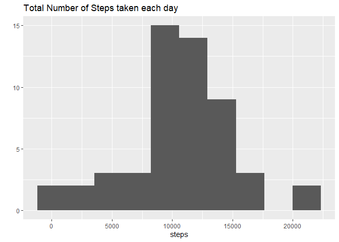
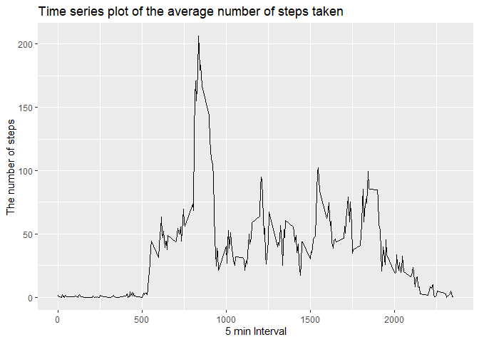
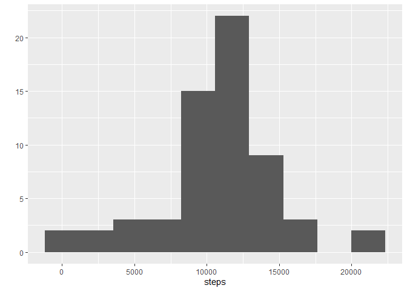
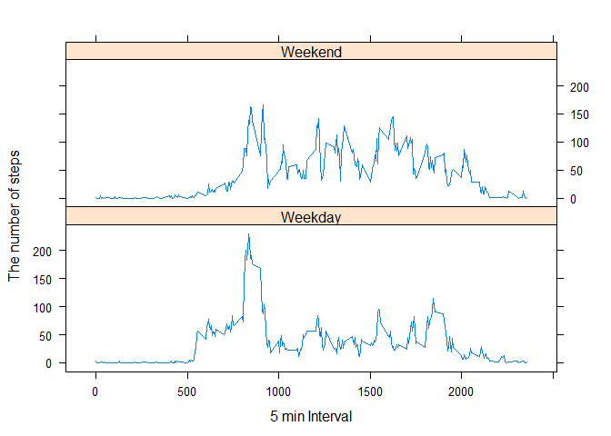

## Loading and preprocessing the data


```r
library(ggplot2)
```

```
## Warning: package 'ggplot2' was built under R version 4.0.5
```

```r
library(lubridate)
```

```
## Warning: package 'lubridate' was built under R version 4.0.5
```

```
## 
## Attaching package: 'lubridate'
```

```
## The following objects are masked from 'package:base':
## 
##     date, intersect, setdiff, union
```

```r
library(dplyr)
```

```
## Warning: package 'dplyr' was built under R version 4.0.5
```

```
## 
## Attaching package: 'dplyr'
```

```
## The following objects are masked from 'package:stats':
## 
##     filter, lag
```

```
## The following objects are masked from 'package:base':
## 
##     intersect, setdiff, setequal, union
```

```r
library(lattice)
Sys.setlocale(category = "LC_TIME", "C")
```

```
## [1] "C"
```

```r
Sys.setenv("LANGUAGE"="e")
path <- getwd()
url <- "https://d396qusza40orc.cloudfront.net/repdata%2Fdata%2Factivity.zip"
download.file(url, file.path(path, "Activity_monitoring_data.zip"))
unzip(zipfile = "Activity_monitoring_data.zip")
```
## What is mean total number of steps taken per day?
read activity data and create sum data to sum_step

```r
activity <- read.csv("activity.csv")
sum_step <- aggregate(steps ~ date, data = activity, sum, na.rm = TRUE)
```
make histogram 

```r
hst <- qplot(steps, data = sum_step, main = "Total Number of Steps taken each day", bins = 10)
hst
```

<!-- -->


## What is the average daily activity pattern?

Calculate Mean and Median number of step taken each day

```r
mean(sum_step$steps, na.rm = TRUE)
```

```
## [1] 10766.19
```

```r
median(sum_step$steps, na.rm = TRUE)
```

```
## [1] 10765
```
Time series plot of the average number of steps taken

```r
time_order <- aggregate(steps ~ interval, data = activity, mean, na.rm = TRUE)
qplot(interval,steps, data = time_order, main = "Time series plot of the average number of steps taken", xlab = "5 min Interval", ylab = "The number of steps",geom = "line")
```

<!-- -->


## Imputing missing values
1.Calculate and report the total number of missing values in the dataset

```r
nrow(is.na(activity))
```

```
## [1] 17568
```

2.Devise a strategy for filling in all of the missing values in the dataset.
replace NA value in steps into mean corresponding to same interval
3.Create a new dataset that is equal to the original dataset but with the missing data filled in.

```r
#time_order contains only one row per day but activity has multiple rows
#[activity$interval$interval] could be 0 and cause error!!
#So exclude activity$interval = 0 and treat it separately
for (i in 1:length(activity$steps)) {if(is.na(activity$steps[i])) {
        if (activity$interval[i] != 0){
    activity$steps[i] <- time_order$steps[time_order$interval == activity$interval[i]]
        }
        else {activity$steps[i] <- time_order$steps[1]}
}
}
head(activity, 20)
```

```
##        steps       date interval
## 1  1.7169811 2012-10-01        0
## 2  0.3396226 2012-10-01        5
## 3  0.1320755 2012-10-01       10
## 4  0.1509434 2012-10-01       15
## 5  0.0754717 2012-10-01       20
## 6  2.0943396 2012-10-01       25
## 7  0.5283019 2012-10-01       30
## 8  0.8679245 2012-10-01       35
## 9  0.0000000 2012-10-01       40
## 10 1.4716981 2012-10-01       45
## 11 0.3018868 2012-10-01       50
## 12 0.1320755 2012-10-01       55
## 13 0.3207547 2012-10-01      100
## 14 0.6792453 2012-10-01      105
## 15 0.1509434 2012-10-01      110
## 16 0.3396226 2012-10-01      115
## 17 0.0000000 2012-10-01      120
## 18 1.1132075 2012-10-01      125
## 19 1.8301887 2012-10-01      130
## 20 0.1698113 2012-10-01      135
```

```r
new_data <- activity
```

4.Make a histogram of the total number of steps taken each day and Calculate and report the mean and median total number of steps taken per day

```r
new_hist <- aggregate(steps ~ date, data = new_data, sum)
qplot(steps, data = new_hist, bins = 10)
```

<!-- -->

```r
# calculate mean and median
mean(new_hist$steps)
```

```
## [1] 10766.19
```

```r
median(new_hist$steps)
```

```
## [1] 10766.19
```


## Are there differences in activity patterns between weekdays and weekends?
1.Create a new factor variable in the dataset with two levels – “weekday” and “weekend” indicating whether a given date is a weekday or weekend day.


```r
new_data$date <- ymd(new_data$date)
new_data$date <- weekdays(new_data$date)
for (i in 1:length(new_data$date)){if (new_data$date[i] == "Saturday" || new_data$date[i] == "Sunday")
        new_data$daytype[i] <- "Weekend"
else new_data$daytype[i] <- "Weekday"
}
new <- aggregate(steps ~ interval + daytype, data =new_data, mean)
```

2.Make a panel plot containing a time series plot (i.e.type = "l") of the 5-minute interval (x-axis) and the average number of steps taken, averaged across all weekday days or weekend days (y-axis). See the README file in the GitHub repository to see an example of what this plot should look like using simulated data.

```r
xyplot(steps ~ interval| daytype, data = new, type = "l", layout = c(1,2), ylab = "The number of steps", xlab = "5 min Interval")
```

<!-- -->
